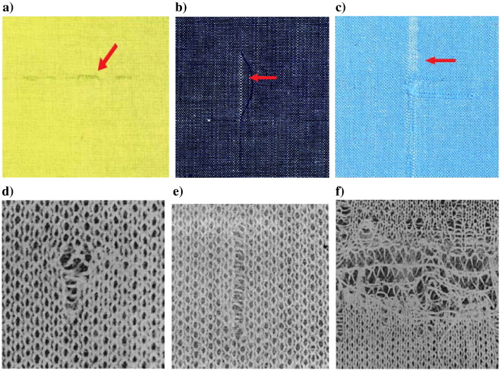

<h1 align="left" style="font-size: 3em; color: #00f7ff; margin-bottom: 0;">
  🧵 Fabric Defect Detector
</h1>

  Real-Time Textile Defect Detection Using YOLOv8

  

  <b>A real-time web application built with YOLOv8 & Streamlit to detect fabric defects like holes, tears, stains, and more.</b>

---

<h3>🚀 Live Demo</h3>

<a href="https://your-streamlit-url.streamlit.app" target="_blank">
  👉 Try it on Streamlit Cloud
</a>

---

<h3>👨‍💻 Developed By</h3>

<ul>
  <li><b>Kirtan Mudaliyar</b></li>
  <li>Namrata Rathod</li>
  <li>Anshal Suthar</li>
  <li>Akansha Ravat</li>
  <li>Dishant Modi</li>
</ul>

---

<h3>🧠 Model Information</h3>

- 📦 Architecture: YOLOv8 (Ultralytics)
- 🧵 Dataset: AITEX Fabric Defect Dataset
- 🎯 Purpose: Identify textile defects in real-time (stains, holes, tears, etc.)

---

<h3>💡 Key Features</h3>

✔️ Upload image or use webcam for inference  
✔️ Real-time YOLOv8 detection  
✔️ Stylish Streamlit UI with dark theme  
✔️ Docker-ready for local/production deployment  

---

